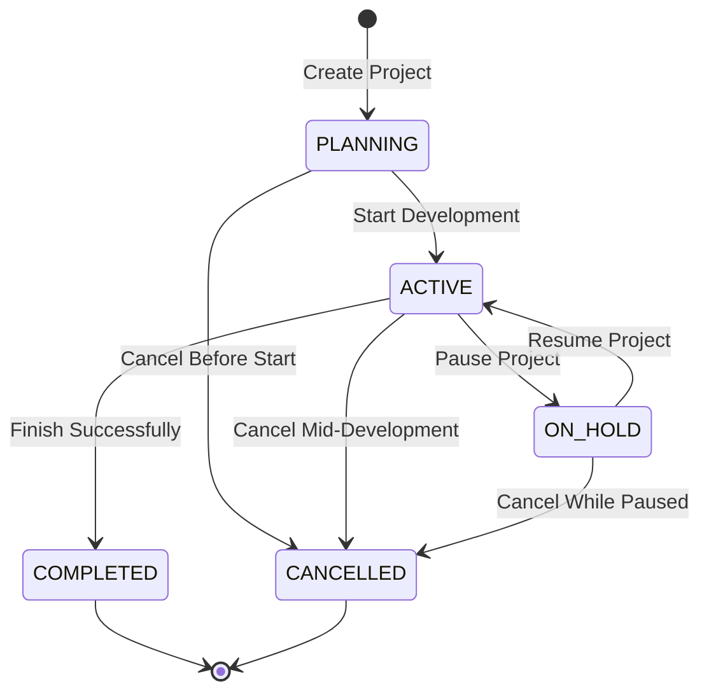
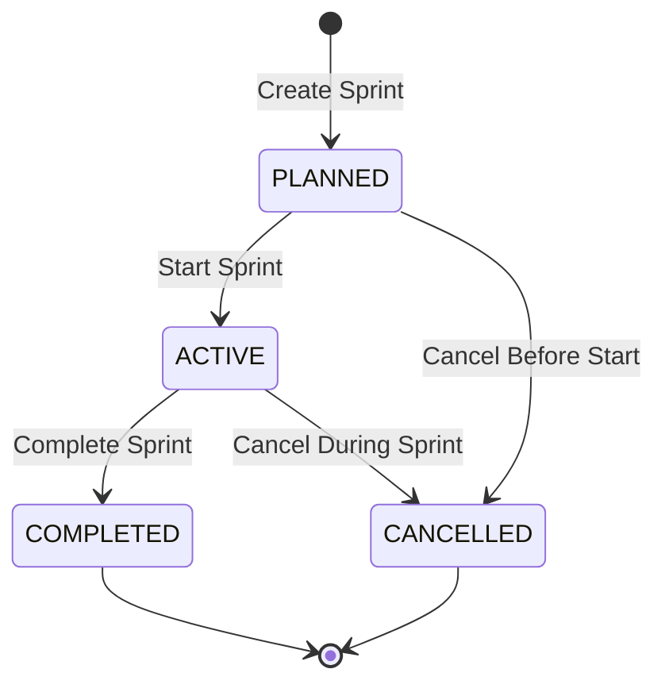
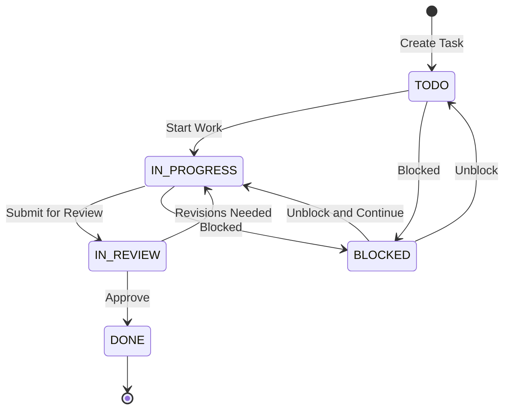

# Project Management Module - Complete Documentation

## 📋 Table of Contents
1. [Overview](#overview)
2. [File Structure](#file-structure)
3. [Database Entities](#database-entities)
4. [Core Features](#core-features)
5. [API Endpoints](#api-endpoints)
6. [Business Logic & Operations](#business-logic--operations)
7. [Status Workflows](#status-workflows)
8. [Team Collaboration](#team-collaboration)
9. [Notification System](#notification-system)
10. [Security & Permissions](#security--permissions)
11. [Front-End Integration](#front-end-integration)
12. [Module Metrics](#module-metrics)

---

## 🎯 Overview

The **Project Management Module** provides comprehensive Agile/Scrum project tracking capabilities, including project lifecycle management, sprint planning, task tracking, team collaboration, and progress monitoring. It supports multi-level team organization with project and sprint-level memberships.

### Key Capabilities:
- **Project Management**: Full lifecycle from planning to completion with status tracking
- **Sprint Management**: Agile sprint planning with time-boxed iterations
- **Task Management**: Detailed task tracking with assignments, priorities, and types
- **Team Collaboration**: Multi-level team structure (project & sprint members)
- **Comments & Attachments**: Rich task discussions and file attachments
- **Real-time Notifications**: Automated notifications for assignments, status changes, and completions
- **Recent Projects**: Quick access to recently accessed projects

---

## 📁 File Structure

### Backend Structure
```
back-end/src/
├── models/entities/
│   ├── project.ts              # Project entity (108 lines)
│   ├── project-member.ts       # Project team member entity (85 lines)
│   ├── sprint.ts               # Sprint entity (88 lines)
│   ├── sprint-member.ts        # Sprint team member entity (68 lines)
│   ├── task.ts                 # Task entity (130 lines)
│   ├── task-comment.ts         # Task comment entity (38 lines)
│   └── task-attachment.ts      # Task attachment entity (53 lines)
│
├── services/
│   └── project.service.ts      # Project business logic (1,190 lines)
│       ├── Project Methods      (9 methods)
│       ├── Sprint Methods       (5 methods)
│       ├── Task Methods         (6 methods)
│       ├── Sprint Member Methods (5 methods)
│       ├── Comment Methods      (4 methods)
│       ├── Attachment Methods   (4 methods)
│       └── Project Member Methods (5 methods)
│
├── controllers/
│   └── project.controller.ts   # HTTP request handlers (1,067+ lines)
│       ├── Project Handlers     (6 handlers)
│       ├── Sprint Handlers      (5 handlers)
│       ├── Task Handlers        (6 handlers)
│       ├── Comment Handlers     (4 handlers)
│       ├── Attachment Handlers  (3 handlers)
│       ├── Sprint Member Handlers (4 handlers)
│       └── Project Member Handlers (4 handlers)
│
└── routes/
    └── projects.ts             # API route definitions (150+ lines, 50+ endpoints)
        ├── Project Routes       (6 routes)
        ├── Sprint Routes        (5 routes)
        ├── Task Routes          (6 routes)
        ├── Comment Routes       (4 routes)
        ├── Attachment Routes    (3 routes)
        ├── Sprint Member Routes (4 routes)
        └── Project Member Routes (4 routes)
```

### Frontend Structure
```
front-end/src/
├── pages/dashboard/sections/Projects/
│   ├── view/
│   │   └── project-list-view.tsx        # Main project list page
│   └── components/
│       ├── project-board-view.tsx       # Kanban board view
│       └── project-details-view.tsx     # Project details page
│
└── services/
    └── project.service.ts               # API client service
```

**Total Module Size**: ~2,700+ lines of code
- Entities: 570 lines
- Service: 1,190 lines
- Controller: 1,067 lines
- Routes: 150 lines
- Frontend: ~500+ lines

---

## 🗄️ Database Entities

### 1. Project Entity
**File**: `back-end/src/models/entities/project.ts`

```typescript
@Entity("projects")
export class Project {
  // Primary Key
  @PrimaryGeneratedColumn("uuid")
  projectId: string;

  // Basic Information
  @Column({ type: "varchar", length: 200 })
  name: string;

  @Column({ type: "text", nullable: true })
  description?: string;

  // Status & Priority
  @Column({ type: "enum", enum: ProjectStatus, default: ProjectStatus.PLANNING })
  @Index()
  status: ProjectStatus;

  @Column({ type: "enum", enum: ProjectPriority, default: ProjectPriority.MEDIUM })
  priority: ProjectPriority;

  // Timeline
  @Column({ type: "date", nullable: true })
  startDate?: Date;

  @Column({ type: "date", nullable: true })
  endDate?: Date;

  // Project Manager
  @Column({ type: "uuid" })
  @Index()
  projectManagerId: string;

  @ManyToOne(() => Employee, { onDelete: "CASCADE" })
  @JoinColumn({ name: "projectManagerId" })
  projectManager: Employee;

  // Recent Access Tracking
  @Column({ type: "timestamp", nullable: true })
  lastAccessedAt?: Date;

  @Column({ type: "boolean", default: false })
  @Index()
  isRecent: boolean;

  // Relationships
  @OneToMany(() => Sprint, (sprint) => sprint.project)
  sprints: Sprint[];

  @OneToMany(() => ProjectMember, (member) => member.project)
  members: ProjectMember[];

  // Timestamps
  @CreateDateColumn()
  createdAt: Date;

  @UpdateDateColumn()
  updatedAt: Date;

  // Methods
  markAsRecent(): void;
  markAsActive(): void;
  complete(): void;
  cancel(): void;
}
```

**Enums**:
```typescript
export enum ProjectStatus {
  PLANNING = "PLANNING",      // Initial planning phase
  ACTIVE = "ACTIVE",          // Active development
  ON_HOLD = "ON_HOLD",        // Temporarily paused
  COMPLETED = "COMPLETED",    // Successfully completed
  CANCELLED = "CANCELLED"     // Cancelled/terminated
}

export enum ProjectPriority {
  LOW = "LOW",
  MEDIUM = "MEDIUM",
  HIGH = "HIGH",
  CRITICAL = "CRITICAL"
}
```

**Relationships**:
- One Project → Many Sprints
- One Project → Many ProjectMembers
- One Project → One Employee (Project Manager)

---

### 2. ProjectMember Entity
**File**: `back-end/src/models/entities/project-member.ts`

```typescript
@Entity("project_members")
@Index(["projectId", "employeeId"], { unique: true, where: '"leftAt" IS NULL' })
export class ProjectMember {
  @PrimaryGeneratedColumn("uuid")
  memberId: string;

  // References
  @Column({ type: "uuid" })
  @Index()
  projectId: string;

  @ManyToOne(() => Project, { onDelete: "CASCADE" })
  @JoinColumn({ name: "projectId" })
  project: Project;

  @Column({ type: "uuid" })
  @Index()
  employeeId: string;

  @ManyToOne(() => Employee, { onDelete: "CASCADE" })
  @JoinColumn({ name: "employeeId" })
  employee: Employee;

  // Role
  @Column({ type: "enum", enum: ProjectMemberRole, default: ProjectMemberRole.DEVELOPER })
  role: ProjectMemberRole;

  // Membership Timeline
  @Column({ type: "timestamp", nullable: true })
  @Index()
  joinedAt: Date;

  @Column({ type: "timestamp", nullable: true })
  @Index()
  leftAt?: Date | null;

  // Timestamps
  @CreateDateColumn()
  createdAt: Date;

  @UpdateDateColumn()
  updatedAt: Date;

  // Methods
  leave(): void;          // Mark member as left
  isActive(): boolean;    // Check if member is still active
  rejoin(): void;         // Reactivate membership
}
```

**Enums**:
```typescript
export enum ProjectMemberRole {
  PROJECT_MANAGER = "PROJECT_MANAGER",
  TECH_LEAD = "TECH_LEAD",
  DEVELOPER = "DEVELOPER",
  DESIGNER = "DESIGNER",
  QA = "QA",
  BUSINESS_ANALYST = "BUSINESS_ANALYST",
  PRODUCT_OWNER = "PRODUCT_OWNER",
  SCRUM_MASTER = "SCRUM_MASTER"
}
```

**Features**:
- Soft-delete support via `leftAt` timestamp
- Unique constraint for active members only
- Support for rejoining projects
- 8 distinct role types

---

### 3. Sprint Entity
**File**: `back-end/src/models/entities/sprint.ts`

```typescript
@Entity("sprints")
export class Sprint {
  @PrimaryGeneratedColumn("uuid")
  sprintId: string;

  // Basic Information
  @Column({ type: "varchar", length: 200 })
  name: string;

  @Column({ type: "text", nullable: true })
  goal?: string;

  // Project Reference
  @Column({ type: "uuid" })
  @Index()
  projectId: string;

  @ManyToOne(() => Project, (project) => project.sprints, { onDelete: "CASCADE" })
  @JoinColumn({ name: "projectId" })
  project: Project;

  // Status
  @Column({ type: "enum", enum: SprintStatus, default: SprintStatus.PLANNED })
  @Index()
  status: SprintStatus;

  // Timeline
  @Column({ type: "date" })
  startDate: Date;

  @Column({ type: "date" })
  endDate: Date;

  // Relationships
  @OneToMany(() => Task, (task) => task.sprint)
  tasks: Task[];

  @OneToMany(() => SprintMember, (member) => member.sprint)
  members: SprintMember[];

  // Timestamps
  @CreateDateColumn()
  createdAt: Date;

  @UpdateDateColumn()
  updatedAt: Date;

  // Methods
  start(): void;
  complete(): void;
  cancel(): void;
  isActive(): boolean;
}
```

**Enums**:
```typescript
export enum SprintStatus {
  PLANNED = "PLANNED",      // Sprint planned but not started
  ACTIVE = "ACTIVE",        // Sprint in progress
  COMPLETED = "COMPLETED",  // Sprint finished
  CANCELLED = "CANCELLED"   // Sprint cancelled
}
```

**Relationships**:
- One Sprint → Many Tasks
- One Sprint → Many SprintMembers
- Many Sprints → One Project

---

### 4. SprintMember Entity
**File**: `back-end/src/models/entities/sprint-member.ts`

```typescript
@Entity("sprint_members")
@Index(["sprintId", "employeeId"], { unique: true, where: '"leftAt" IS NULL' })
export class SprintMember {
  @PrimaryGeneratedColumn("uuid")
  sprintMemberId: string;

  // References
  @Column({ type: "uuid" })
  @Index()
  sprintId: string;

  @ManyToOne(() => Sprint, (sprint) => sprint.members, { onDelete: "CASCADE" })
  @JoinColumn({ name: "sprintId" })
  sprint: Sprint;

  @Column({ type: "uuid" })
  @Index()
  employeeId: string;

  @ManyToOne(() => Employee, { onDelete: "CASCADE" })
  @JoinColumn({ name: "employeeId" })
  employee: Employee;

  // Role
  @Column({ type: "enum", enum: SprintMemberRole, default: SprintMemberRole.DEVELOPER })
  role: SprintMemberRole;

  // Timeline
  @CreateDateColumn()
  joinedAt: Date;

  @Column({ type: "timestamp", nullable: true })
  leftAt?: Date;

  // Methods
  isActive(): boolean;
  leave(): void;
}
```

**Enums**:
```typescript
export enum SprintMemberRole {
  DEVELOPER = "DEVELOPER",
  TESTER = "TESTER",
  REVIEWER = "REVIEWER",
  SCRUM_MASTER = "SCRUM_MASTER",
  PRODUCT_OWNER = "PRODUCT_OWNER",
  OBSERVER = "OBSERVER"
}
```

---

### 5. Task Entity
**File**: `back-end/src/models/entities/task.ts`

```typescript
@Entity("tasks")
export class Task {
  @PrimaryGeneratedColumn("uuid")
  taskId: string;

  // Basic Information
  @Column({ type: "varchar", length: 200 })
  title: string;

  @Column({ type: "text", nullable: true })
  description?: string;

  // Sprint Reference
  @Column({ type: "uuid" })
  @Index()
  sprintId: string;

  @ManyToOne(() => Sprint, (sprint) => sprint.tasks, { onDelete: "CASCADE" })
  @JoinColumn({ name: "sprintId" })
  sprint: Sprint;

  // Classification
  @Column({ type: "enum", enum: TaskStatus, default: TaskStatus.TODO })
  @Index()
  status: TaskStatus;

  @Column({ type: "enum", enum: TaskPriority, default: TaskPriority.MEDIUM })
  priority: TaskPriority;

  @Column({ type: "enum", enum: TaskType, default: TaskType.TASK })
  taskType: TaskType;

  // Assignment
  @Column({ type: "uuid", nullable: true })
  @Index()
  assignedTo?: string;

  @ManyToOne(() => Employee, { nullable: true, onDelete: "SET NULL" })
  @JoinColumn({ name: "assignedTo" })
  assignee?: Employee;

  // Estimation & Tracking
  @Column({ type: "int", nullable: true })
  storyPoints?: number;

  @Column({ type: "int", nullable: true })
  estimatedHours?: number;

  @Column({ type: "int", nullable: true })
  actualHours?: number;

  // Relationships
  @OneToMany(() => TaskComment, (comment) => comment.task)
  comments: TaskComment[];

  @OneToMany(() => TaskAttachment, (attachment) => attachment.task)
  attachments: TaskAttachment[];

  // Timestamps
  @CreateDateColumn()
  createdAt: Date;

  @UpdateDateColumn()
  updatedAt: Date;

  // Methods
  moveToInProgress(): void;
  moveToReview(): void;
  complete(): void;
  block(): void;
  assign(employeeId: string): void;
}
```

**Enums**:
```typescript
export enum TaskStatus {
  TODO = "TODO",
  IN_PROGRESS = "IN_PROGRESS",
  IN_REVIEW = "IN_REVIEW",
  DONE = "DONE",
  BLOCKED = "BLOCKED"
}

export enum TaskPriority {
  LOW = "LOW",
  MEDIUM = "MEDIUM",
  HIGH = "HIGH",
  CRITICAL = "CRITICAL"
}

export enum TaskType {
  STORY = "STORY",  // User story
  BUG = "BUG",      // Bug fix
  TASK = "TASK",    // General task
  EPIC = "EPIC"     // Large feature
}
```

---

### 6. TaskComment Entity
**File**: `back-end/src/models/entities/task-comment.ts`

```typescript
@Entity("task_comments")
export class TaskComment {
  @PrimaryGeneratedColumn("uuid")
  commentId: string;

  @Column("uuid")
  taskId: string;

  @Column("uuid")
  authorId: string;

  @Column("text")
  content: string;

  @CreateDateColumn()
  createdAt: Date;

  @UpdateDateColumn()
  updatedAt: Date;

  // Relations
  @ManyToOne(() => Task, (task) => task.comments, { onDelete: "CASCADE" })
  @JoinColumn({ name: "taskId" })
  task: Task;

  @ManyToOne(() => Employee)
  @JoinColumn({ name: "authorId" })
  author: Employee;
}
```

---

### 7. TaskAttachment Entity
**File**: `back-end/src/models/entities/task-attachment.ts`

```typescript
@Entity("task_attachments")
export class TaskAttachment {
  @PrimaryGeneratedColumn("uuid")
  attachmentId: string;

  @Column("uuid")
  taskId: string;

  @Column("uuid")
  uploadedById: string;

  // File Metadata
  @Column()
  fileName: string;

  @Column()
  filePath: string;

  @Column()
  fileSize: number;

  @Column()
  mimeType: string;

  @Column({ type: "enum", enum: AttachmentType, default: AttachmentType.OTHER })
  type: AttachmentType;

  @CreateDateColumn()
  uploadedAt: Date;

  // Relations
  @ManyToOne(() => Task, (task) => task.attachments, { onDelete: "CASCADE" })
  @JoinColumn({ name: "taskId" })
  task: Task;

  @ManyToOne(() => Employee)
  @JoinColumn({ name: "uploadedById" })
  uploadedBy: Employee;
}
```

**Enums**:
```typescript
export enum AttachmentType {
  IMAGE = "IMAGE",
  DOCUMENT = "DOCUMENT",
  OTHER = "OTHER"
}
```

---

## 🎯 Core Features

### 1. Project Management
- **Project Lifecycle**: Complete project tracking from planning to completion
- **Status Management**: 5 project statuses (PLANNING, ACTIVE, ON_HOLD, COMPLETED, CANCELLED)
- **Priority Levels**: 4 priority levels (LOW, MEDIUM, HIGH, CRITICAL)
- **Project Manager Assignment**: Automatic assignment of creator as project manager
- **Recent Projects**: Track recently accessed projects for quick access
- **Team Management**: Add/remove team members with role assignments
- **Filtering & Pagination**: Filter by status, employee, recent access with pagination support

### 2. Sprint Management
- **Time-boxed Iterations**: Define sprints with start and end dates
- **Sprint Goals**: Set clear goals for each sprint
- **Sprint Status**: Track sprint progress (PLANNED, ACTIVE, COMPLETED, CANCELLED)
- **Sprint Teams**: Dedicated team members per sprint
- **Task Association**: Link tasks to specific sprints
- **Sprint Lifecycle**: Start, complete, or cancel sprints

### 3. Task Management
- **Detailed Tasks**: Create tasks with titles, descriptions, and types
- **Task Types**: 4 types (STORY, BUG, TASK, EPIC)
- **Task Status Workflow**: 5 statuses (TODO, IN_PROGRESS, IN_REVIEW, DONE, BLOCKED)
- **Priority Management**: Assign priorities to tasks
- **Task Assignment**: Assign tasks to employees
- **Estimation**: Story points and hour estimates
- **Time Tracking**: Track actual hours spent
- **Comments**: Add discussion comments to tasks
- **Attachments**: Upload files to tasks

### 4. Team Collaboration
- **Two-Level Team Structure**:
  - **Project Members**: Overall project team
  - **Sprint Members**: Sprint-specific team assignments
- **Role-Based Teams**: Different roles for project and sprint members
- **Member Lifecycle**: Add, remove, or update member roles
- **Active Member Tracking**: Soft-delete for member removal history

### 5. Notification System
- **Task Assignment**: Notify when tasks are assigned
- **Status Updates**: Notify on task status changes
- **Task Completion**: Notify team when tasks are completed
- **Task Reassignment**: Notify on task reassignments
- **Sprint Membership**: Notify when added/removed from sprints
- **Project Membership**: Notify when added/removed from projects

### 6. Comments & Attachments
- **Task Comments**: Add, update, delete comments on tasks
- **Comment Authors**: Track comment authors
- **File Attachments**: Upload files to tasks
- **Attachment Types**: Categorize attachments (IMAGE, DOCUMENT, OTHER)
- **File Metadata**: Track file size, MIME type, and upload info

---

## 🔌 API Endpoints

### Project Endpoints (6 routes)

| Method | Endpoint | Description | Auth Required |
|--------|----------|-------------|---------------|
| POST | `/api/projects` | Create new project | ✅ |
| GET | `/api/projects` | List all projects (with filters) | ✅ |
| GET | `/api/projects/employee/:employeeId` | Get projects by employee | ✅ |
| GET | `/api/projects/:projectId` | Get project details | ✅ |
| PUT | `/api/projects/:projectId` | Update project | ✅ |
| DELETE | `/api/projects/:projectId` | Delete project | ✅ |

**Query Parameters for GET /api/projects**:
- `status`: Filter by ProjectStatus
- `employeeId`: Filter by employee membership
- `isRecent`: Filter recent projects
- `limit`: Pagination limit
- `offset`: Pagination offset

---

### Sprint Endpoints (5 routes)

| Method | Endpoint | Description | Auth Required |
|--------|----------|-------------|---------------|
| POST | `/api/projects/sprints` | Create new sprint | ✅ |
| GET | `/api/projects/:projectId/sprints` | List sprints by project | ✅ |
| GET | `/api/projects/sprints/:sprintId` | Get sprint details | ✅ |
| PUT | `/api/projects/sprints/:sprintId` | Update sprint | ✅ |
| DELETE | `/api/projects/sprints/:sprintId` | Delete sprint | ✅ |

**Query Parameters for GET /api/projects/:projectId/sprints**:
- `status`: Filter by SprintStatus
- `limit`: Pagination limit
- `offset`: Pagination offset

---

### Task Endpoints (6 routes)

| Method | Endpoint | Description | Auth Required |
|--------|----------|-------------|---------------|
| POST | `/api/projects/tasks` | Create new task | ✅ |
| GET | `/api/projects/sprints/:sprintId/tasks` | List tasks by sprint | ✅ |
| GET | `/api/projects/tasks/:taskId` | Get task details | ✅ |
| GET | `/api/projects/employees/:employeeId/tasks` | Get tasks by employee | ✅ |
| PUT | `/api/projects/tasks/:taskId` | Update task | ✅ |
| DELETE | `/api/projects/tasks/:taskId` | Delete task | ✅ |

**Query Parameters for Task Lists**:
- `status`: Filter by TaskStatus
- `assignedTo`: Filter by assignee
- `limit`: Pagination limit
- `offset`: Pagination offset

---

### Comment Endpoints (4 routes)

| Method | Endpoint | Description | Auth Required |
|--------|----------|-------------|---------------|
| POST | `/api/projects/tasks/:taskId/comments` | Add comment | ✅ |
| GET | `/api/projects/tasks/:taskId/comments` | List comments | ✅ |
| PUT | `/api/projects/comments/:commentId` | Update comment | ✅ |
| DELETE | `/api/projects/comments/:commentId` | Delete comment | ✅ |

---

### Attachment Endpoints (3 routes)

| Method | Endpoint | Description | Auth Required |
|--------|----------|-------------|---------------|
| POST | `/api/projects/tasks/:taskId/attachments` | Add attachment | ✅ |
| GET | `/api/projects/tasks/:taskId/attachments` | List attachments | ✅ |
| DELETE | `/api/projects/attachments/:attachmentId` | Delete attachment | ✅ |

---

### Sprint Member Endpoints (4 routes)

| Method | Endpoint | Description | Auth Required |
|--------|----------|-------------|---------------|
| POST | `/api/projects/sprints/:sprintId/members` | Add sprint member | ✅ |
| GET | `/api/projects/sprints/:sprintId/members` | List sprint members | ✅ |
| PUT | `/api/projects/sprints/:sprintId/members/:employeeId` | Update member role | ✅ |
| DELETE | `/api/projects/sprints/:sprintId/members/:employeeId` | Remove sprint member | ✅ |

---

### Project Member Endpoints (4 routes)

| Method | Endpoint | Description | Auth Required |
|--------|----------|-------------|---------------|
| POST | `/api/projects/:projectId/members` | Add project member | ✅ |
| GET | `/api/projects/:projectId/members` | List project members | ✅ |
| PUT | `/api/projects/:projectId/members/:employeeId` | Update member role | ✅ |
| DELETE | `/api/projects/:projectId/members/:employeeId` | Remove project member | ✅ |

---

**Total API Endpoints**: 32+ endpoints

---

## ⚙️ Business Logic & Operations

### Project Service Methods

#### 1. Project Operations (9 methods)

```typescript
// Create Project
async createProject(data: {
  name: string;
  description?: string;
  status?: ProjectStatus;
  priority?: ProjectPriority;
  startDate?: Date;
  endDate?: Date;
  projectManagerId: string;
}): Promise<Project>
```

```typescript
// Get Projects with Filters
async getProjects(options?: {
  status?: ProjectStatus;
  employeeId?: string;
  isRecent?: boolean;
  limit?: number;
  offset?: number;
}): Promise<{ projects: Project[]; total: number }>
```

```typescript
// Get Projects by Employee
async getProjectsByEmployeeId(options: {
  employeeId: string;
  status?: ProjectStatus;
  isRecent?: boolean;
  limit?: number;
  offset?: number;
}): Promise<{ projects: Project[]; total: number }>
```

```typescript
// Get Single Project
async getProjectById(projectId: string): Promise<Project | null>
```

```typescript
// Update Project (with Member Synchronization)
async updateProject(
  projectId: string,
  data: Partial<Project> & {
    members?: Array<{ employeeId: string; role: string }>;
  }
): Promise<Project | null>
```
- Synchronizes team members
- Marks members as left if removed
- Adds new members
- Updates existing member roles
- Reactivates previously removed members

```typescript
// Mark Project as Recent
async markProjectAsRecent(projectId: string): Promise<Project | null>
```

```typescript
// Delete Project
async deleteProject(projectId: string): Promise<boolean>
```

---

#### 2. Sprint Operations (5 methods)

```typescript
// Create Sprint
async createSprint(data: {
  name: string;
  goal?: string;
  projectId: string;
  startDate: Date;
  endDate: Date;
  status?: SprintStatus;
}): Promise<Sprint>
```

```typescript
// Get Sprints by Project
async getSprintsByProject(
  projectId: string,
  options?: {
    status?: SprintStatus;
    limit?: number;
    offset?: number;
  }
): Promise<{ sprints: Sprint[]; total: number }>
```

```typescript
// Get Single Sprint
async getSprintById(sprintId: string): Promise<Sprint | null>
```

```typescript
// Update Sprint
async updateSprint(
  sprintId: string,
  data: Partial<Sprint>
): Promise<Sprint | null>
```

```typescript
// Delete Sprint
async deleteSprint(sprintId: string): Promise<boolean>
```

---

#### 3. Task Operations (6 methods)

```typescript
// Create Task (with Assignment Notification)
async createTask(
  data: {
    title: string;
    description?: string;
    sprintId: string;
    status?: TaskStatus;
    priority?: TaskPriority;
    taskType?: TaskType;
    assignedTo?: string;
    storyPoints?: number;
    estimatedHours?: number;
  },
  createdByUserId?: string
): Promise<Task>
```
- Sends notification if task is assigned

```typescript
// Get Tasks by Sprint
async getTasksBySprint(
  sprintId: string,
  options?: {
    status?: TaskStatus;
    assignedTo?: string;
    limit?: number;
    offset?: number;
  }
): Promise<{ tasks: Task[]; total: number }>
```

```typescript
// Get Single Task
async getTaskById(taskId: string): Promise<Task | null>
```

```typescript
// Update Task (with Notification Logic)
async updateTask(
  taskId: string,
  data: Partial<Task>,
  updatedByUserId?: string
): Promise<Task | null>
```
- Notifies on status change
- Notifies team when task is completed
- Notifies on reassignment

```typescript
// Delete Task
async deleteTask(taskId: string): Promise<boolean>
```

```typescript
// Get Tasks by Employee
async getTasksByEmployee(
  employeeId: string,
  options?: {
    status?: TaskStatus;
    limit?: number;
    offset?: number;
  }
): Promise<{ tasks: Task[]; total: number }>
```

---

#### 4. Sprint Member Operations (5 methods)

```typescript
// Add Sprint Member (with Notification)
async addSprintMember(
  data: {
    sprintId: string;
    employeeId: string;
    role?: SprintMemberRole;
  },
  addedByUserId?: string
): Promise<SprintMember>
```

```typescript
// Remove Sprint Member (with Notification)
async removeSprintMember(
  sprintId: string,
  employeeId: string,
  removedByUserId?: string
): Promise<void>
```

```typescript
// Update Sprint Member Role
async updateSprintMemberRole(
  sprintId: string,
  employeeId: string,
  role: SprintMemberRole
): Promise<SprintMember | null>
```

```typescript
// Get Sprint Members
async getSprintMembers(sprintId: string): Promise<SprintMember[]>
```

```typescript
// Get Active Sprint Members
async getActiveSprintMembers(sprintId: string): Promise<SprintMember[]>
```

---

#### 5. Comment Operations (4 methods)

```typescript
// Add Comment
async addComment(data: {
  taskId: string;
  authorId: string;
  content: string;
}): Promise<TaskComment>
```

```typescript
// Get Comments by Task
async getCommentsByTask(taskId: string): Promise<TaskComment[]>
```

```typescript
// Update Comment
async updateComment(
  commentId: string,
  content: string
): Promise<TaskComment | null>
```

```typescript
// Delete Comment
async deleteComment(commentId: string): Promise<boolean>
```

---

#### 6. Attachment Operations (4 methods)

```typescript
// Add Attachment
async addAttachment(data: {
  taskId: string;
  uploadedById: string;
  fileName: string;
  filePath: string;
  fileSize: number;
  mimeType: string;
  type: AttachmentType;
}): Promise<TaskAttachment>
```

```typescript
// Get Attachments by Task
async getAttachmentsByTask(taskId: string): Promise<TaskAttachment[]>
```

```typescript
// Get Attachment by ID
async getAttachmentById(
  attachmentId: string
): Promise<TaskAttachment | null>
```

```typescript
// Delete Attachment
async deleteAttachment(attachmentId: string): Promise<boolean>
```

---

#### 7. Project Member Operations (5 methods)

```typescript
// Add Project Member (with Notification)
async addProjectMember(
  data: {
    projectId: string;
    employeeId: string;
    role?: ProjectMemberRole;
  },
  addedByUserId?: string
): Promise<ProjectMember>
```

```typescript
// Remove Project Member (with Notification)
async removeProjectMember(
  projectId: string,
  employeeId: string,
  removedByUserId?: string
): Promise<void>
```

```typescript
// Update Project Member Role
async updateProjectMemberRole(
  projectId: string,
  employeeId: string,
  role: ProjectMemberRole
): Promise<ProjectMember | null>
```

```typescript
// Get Project Members
async getProjectMembers(projectId: string): Promise<ProjectMember[]>
```

```typescript
// Get Active Project Members
async getActiveProjectMembers(projectId: string): Promise<ProjectMember[]>
```

---

**Total Service Methods**: 38 methods across 7 categories

---

## 🔄 Status Workflows

### Project Status Workflow



**Project Status Transitions**:
1. **PLANNING** → **ACTIVE**: Project development begins
2. **ACTIVE** → **ON_HOLD**: Project paused temporarily
3. **ON_HOLD** → **ACTIVE**: Project resumed
4. **ACTIVE** → **COMPLETED**: Project successfully finished
5. **PLANNING/ACTIVE/ON_HOLD** → **CANCELLED**: Project terminated

---

### Sprint Status Workflow



**Sprint Status Transitions**:
1. **PLANNED** → **ACTIVE**: Sprint begins
2. **ACTIVE** → **COMPLETED**: Sprint ends successfully
3. **PLANNED/ACTIVE** → **CANCELLED**: Sprint cancelled

---

### Task Status Workflow



**Task Status Transitions**:
1. **TODO** → **IN_PROGRESS**: Developer starts work
2. **IN_PROGRESS** → **IN_REVIEW**: Code submitted for review
3. **IN_REVIEW** → **IN_PROGRESS**: Reviewer requests changes
4. **IN_REVIEW** → **DONE**: Task approved and completed
5. **TODO/IN_PROGRESS** → **BLOCKED**: Task blocked by dependency
6. **BLOCKED** → **TODO/IN_PROGRESS**: Blocker resolved

---

## 👥 Team Collaboration

### Two-Level Team Structure

#### 1. Project-Level Teams (ProjectMember)

**Purpose**: Overall project team membership

**Roles**:
- `PROJECT_MANAGER`: Project lead and owner
- `TECH_LEAD`: Technical leadership
- `DEVELOPER`: Software development
- `DESIGNER`: UI/UX design
- `QA`: Quality assurance and testing
- `BUSINESS_ANALYST`: Requirements and analysis
- `PRODUCT_OWNER`: Product vision and backlog
- `SCRUM_MASTER`: Agile process facilitation

**Features**:
- Soft-delete member tracking
- Member join/leave history
- Role updates
- Reactivation support

---

#### 2. Sprint-Level Teams (SprintMember)

**Purpose**: Sprint-specific team assignments

**Roles**:
- `DEVELOPER`: Sprint development work
- `TESTER`: Sprint testing tasks
- `REVIEWER`: Code review responsibilities
- `SCRUM_MASTER`: Sprint facilitation
- `PRODUCT_OWNER`: Sprint planning and acceptance
- `OBSERVER`: Non-participating observers

**Features**:
- Sprint-specific team composition
- Active member tracking
- Member join/leave per sprint
- Role assignments per sprint

---

### Member Management Flow

1. **Add Member to Project**:
   ```typescript
   POST /api/projects/:projectId/members
   Body: { employeeId, role }
   ```
   - Validates employee exists
   - Checks for existing membership
   - Creates ProjectMember record
   - Sends notification

2. **Add Member to Sprint**:
   ```typescript
   POST /api/projects/sprints/:sprintId/members
   Body: { employeeId, role }
   ```
   - Validates employee exists
   - Checks for existing membership
   - Creates SprintMember record
   - Sends notification

3. **Remove Member**:
   - Soft-delete via `leftAt` timestamp
   - Preserves membership history
   - Sends removal notification

4. **Update Member Role**:
   - Updates role while preserving membership
   - No notification sent for role updates

---

## 🔔 Notification System

### Task Assignment Notification
**Trigger**: Task assigned to employee

**Notification Details**:
- Employee notified via real-time notification
- Includes: Task title, task ID, project name, sprint name, priority, assigned by

**Service Method**:
```typescript
await notificationService.notifyTaskAssigned({
  employeeUserId: string,
  taskTitle: string,
  taskId: string,
  projectName: string,
  sprintName: string,
  priority: TaskPriority,
  assignedByName: string,
  assignedByUserId?: string
});
```

---

### Task Status Update Notification
**Trigger**: Task status changed

**Notification Details**:
- Assignee notified of status change
- Includes: Task title, old status, new status, project, sprint, updated by

**Service Method**:
```typescript
await notificationService.notifyTaskStatusUpdated({
  employeeUserId: string,
  taskTitle: string,
  taskId: string,
  oldStatus: TaskStatus,
  newStatus: TaskStatus,
  projectName: string,
  sprintName: string,
  updatedByName: string,
  updatedByUserId?: string
});
```

---

### Task Completion Notification
**Trigger**: Task marked as DONE

**Notification Details**:
- All sprint members notified
- Includes: Task title, task ID, project, sprint, completed by

**Service Method**:
```typescript
await notificationService.notifyTaskCompleted({
  teamMemberUserIds: string[],
  taskTitle: string,
  taskId: string,
  completedByName: string,
  completedByUserId: string,
  projectName: string,
  sprintName: string
});
```

---

### Task Reassignment Notification
**Trigger**: Task assigned to different employee

**Notification Details**:
- New assignee notified
- Old assignee notified (if exists)
- Includes: Task title, project, sprint, reassigned by

**Service Method**:
```typescript
await notificationService.notifyTaskReassigned({
  newEmployeeUserId: string,
  oldEmployeeUserId?: string,
  taskTitle: string,
  taskId: string,
  projectName: string,
  sprintName: string,
  reassignedByName: string,
  reassignedByUserId?: string
});
```

---

### Sprint Membership Notifications

**Added to Sprint**:
```typescript
await notificationService.notifyAddedToSprint({
  employeeUserId: string,
  sprintName: string,
  projectName: string,
  role: SprintMemberRole,
  addedByName: string,
  addedByUserId?: string
});
```

**Removed from Sprint**:
```typescript
await notificationService.notifyRemovedFromSprint({
  employeeUserId: string,
  sprintName: string,
  projectName: string,
  removedByName: string,
  removedByUserId?: string
});
```

---

### Project Membership Notifications

**Added to Project**:
```typescript
await notificationService.notifyAddedToProject({
  employeeUserId: string,
  projectName: string,
  role: ProjectMemberRole,
  managerName: string,
  managerUserId: string
});
```

**Removed from Project**:
```typescript
await notificationService.notifyRemovedFromProject({
  employeeUserId: string,
  projectName: string,
  managerName: string,
  managerUserId: string
});
```

---

**Total Notification Types**: 8 notification types

---

## 🔒 Security & Permissions

### Authentication

All Project Management API endpoints require **JWT authentication**:

```typescript
router.post('/projects', authenticateToken, createProject);
router.get('/projects', authenticateToken, getProjects);
// ... all routes protected
```

**Authentication Middleware**: `authenticateToken` from `auth.middleware.ts`

---

### Permission Requirements

While specific permission middleware is not applied at the route level, the following permissions are managed at the application level:

**Project Permissions**:
- `PROJECT_CREATE`: Create new projects
- `PROJECT_READ`: View project details
- `PROJECT_UPDATE`: Modify project information
- `PROJECT_DELETE`: Delete projects
- `PROJECT_MANAGE_MEMBERS`: Add/remove project members

**Sprint Permissions**:
- `SPRINT_CREATE`: Create sprints
- `SPRINT_READ`: View sprint details
- `SPRINT_UPDATE`: Modify sprint information
- `SPRINT_DELETE`: Delete sprints
- `SPRINT_MANAGE_MEMBERS`: Add/remove sprint members

**Task Permissions**:
- `TASK_CREATE`: Create tasks
- `TASK_READ`: View task details
- `TASK_UPDATE`: Update task status/details
- `TASK_DELETE`: Delete tasks
- `TASK_ASSIGN`: Assign tasks to employees
- `TASK_COMMENT`: Add comments to tasks
- `TASK_ATTACH`: Upload attachments to tasks

---

### Authorization Logic

**Project Creation**:
- User authenticated via JWT
- User's employee record looked up
- Creator automatically assigned as PROJECT_MANAGER

**Member Management**:
- Project managers can add/remove members
- Only active members can be assigned to sprints
- Soft-delete preserves membership history

**Task Assignment**:
- Tasks can be assigned to any employee
- Assignee must be an active employee
- Notifications sent on assignment/reassignment

---

### Data Access Control

**Project Access**:
- Users can only see projects where they are:
  - Project manager
  - Active project member
  - Active sprint member

**Task Access**:
- Users can see tasks in their assigned sprints
- Users can see tasks assigned to them
- Project/sprint members can view all tasks in their sprints

---

## 🌐 Front-End Integration

### Frontend Service Layer

**File**: `front-end/src/services/project.service.ts`

API client service that communicates with backend endpoints.

---

### Frontend Pages

#### 1. Project List View
**File**: `front-end/src/pages/dashboard/sections/Projects/view/project-list-view.tsx`

**Features**:
- Display all projects for logged-in user
- Filter by status
- Show recent projects
- Project creation form
- Navigation to project details

---

#### 2. Project Board View
**File**: `front-end/src/pages/dashboard/sections/Projects/components/project-board-view.tsx`

**Features**:
- Kanban board visualization
- Task cards by status columns
- Drag-and-drop task status updates
- Visual task priority indicators
- Quick task details preview

---

#### 3. Project Details View
**File**: `front-end/src/pages/dashboard/sections/Projects/components/project-details-view.tsx`

**Features**:
- Project information display
- Sprint list and details
- Task list with filters
- Team member display
- Project statistics
- Edit project form

---

### Frontend Data Models

**Base API Client**: `front-end/src/services/project.service.ts`

Example API calls:
```typescript
// Get all projects
const projects = await projectService.getProjects({
  status: 'ACTIVE',
  isRecent: true
});

// Create project
const newProject = await projectService.createProject({
  name: 'New Project',
  description: 'Project description',
  priority: 'HIGH',
  startDate: new Date(),
  projectManagerId: 'employee-uuid'
});

// Create sprint
const sprint = await projectService.createSprint({
  name: 'Sprint 1',
  goal: 'Initial MVP features',
  projectId: 'project-uuid',
  startDate: new Date(),
  endDate: new Date(Date.now() + 14 * 24 * 60 * 60 * 1000)
});

// Create task
const task = await projectService.createTask({
  title: 'Implement login',
  sprintId: 'sprint-uuid',
  priority: 'HIGH',
  taskType: 'STORY',
  assignedTo: 'employee-uuid'
});
```

---

### Real-Time Updates

The Project Management module integrates with the real-time notification system:

**Socket Context**: `front-end/src/context/socket-provider.tsx`

**Event Listeners**:
- `task:assigned` - New task assignment
- `task:status-updated` - Task status change
- `task:completed` - Task completion
- `task:reassigned` - Task reassignment
- `sprint:member-added` - Added to sprint
- `sprint:member-removed` - Removed from sprint
- `project:member-added` - Added to project
- `project:member-removed` - Removed from project

---

## 📊 Module Metrics

### Code Metrics

| Component | Files | Lines of Code |
|-----------|-------|---------------|
| **Entities** | 7 files | ~570 lines |
| **Service** | 1 file | 1,190 lines |
| **Controller** | 1 file | 1,067+ lines |
| **Routes** | 1 file | 150+ lines |
| **Frontend** | 3+ files | ~500+ lines |
| **TOTAL** | 13+ files | **~3,500+ lines** |

---

### Feature Metrics

| Category | Count |
|----------|-------|
| **Database Entities** | 7 entities |
| **API Endpoints** | 32+ endpoints |
| **Service Methods** | 38 methods |
| **Controller Handlers** | 32 handlers |
| **Enums** | 8 enums |
| **Entity Relationships** | 15+ relationships |
| **Notification Types** | 8 types |
| **Project Statuses** | 5 statuses |
| **Sprint Statuses** | 4 statuses |
| **Task Statuses** | 5 statuses |
| **Project Member Roles** | 8 roles |
| **Sprint Member Roles** | 6 roles |
| **Task Types** | 4 types |
| **Task Priorities** | 4 priorities |

---

### Entity Breakdown

```
Project Management Module Structure:
│
├── Project (108 lines)
│   ├── 13 attributes
│   ├── 2 enums (Status, Priority)
│   ├── 4 methods
│   └── 3 relationships
│
├── ProjectMember (85 lines)
│   ├── 8 attributes
│   ├── 1 enum (Role - 8 values)
│   ├── 3 methods
│   └── 2 relationships
│
├── Sprint (88 lines)
│   ├── 9 attributes
│   ├── 1 enum (Status)
│   ├── 4 methods
│   └── 3 relationships
│
├── SprintMember (68 lines)
│   ├── 6 attributes
│   ├── 1 enum (Role - 6 values)
│   ├── 2 methods
│   └── 2 relationships
│
├── Task (130 lines)
│   ├── 13 attributes
│   ├── 3 enums (Status, Priority, Type)
│   ├── 5 methods
│   └── 4 relationships
│
├── TaskComment (38 lines)
│   ├── 6 attributes
│   ├── 0 enums
│   ├── 0 methods
│   └── 2 relationships
│
└── TaskAttachment (53 lines)
    ├── 10 attributes
    ├── 1 enum (Type)
    ├── 0 methods
    └── 2 relationships
```

---

### Operational Complexity

**Service Operations Breakdown**:
- Project Operations: 9 methods
- Sprint Operations: 5 methods
- Task Operations: 6 methods
- Sprint Member Operations: 5 methods
- Comment Operations: 4 methods
- Attachment Operations: 4 methods
- Project Member Operations: 5 methods

**Controller Handlers**: 32 request handlers

**Total Service Methods**: 38 methods

---

## 🎯 Key Design Patterns

### 1. Soft-Delete Pattern
- ProjectMember and SprintMember use `leftAt` timestamp
- Preserves membership history
- Enables member reactivation
- Unique constraints only for active members

### 2. Automatic Member Assignment
- Project creator automatically becomes PROJECT_MANAGER
- No manual role assignment needed on creation

### 3. Notification Integration
- Async notifications don't block operations
- Failures logged but don't fail transactions
- Comprehensive coverage of team events

### 4. Cascading Relationships
- Delete project → cascade to sprints, members, tasks
- Delete sprint → cascade to tasks, members
- Delete task → cascade to comments, attachments
- Employee deletion → SET NULL on task assignment

### 5. Recent Access Tracking
- `lastAccessedAt` timestamp updated on access
- `isRecent` boolean flag for quick filtering
- Enables "Recent Projects" feature

### 6. Two-Level Team Structure
- Project-level teams (long-term)
- Sprint-level teams (short-term, focused)
- Different role sets for each level

---

## 🔧 Example Workflows

### Workflow 1: Create Project with Team

```typescript
// 1. Create project
const project = await projectService.createProject({
  name: 'Customer Portal',
  description: 'New customer-facing portal',
  priority: ProjectPriority.HIGH,
  startDate: new Date(),
  projectManagerId: 'manager-uuid'
});
// Creator automatically assigned as PROJECT_MANAGER

// 2. Add team members
await projectService.addProjectMember({
  projectId: project.projectId,
  employeeId: 'developer-1-uuid',
  role: ProjectMemberRole.DEVELOPER
}, 'manager-user-uuid');

await projectService.addProjectMember({
  projectId: project.projectId,
  employeeId: 'designer-1-uuid',
  role: ProjectMemberRole.DESIGNER
}, 'manager-user-uuid');

// 3. Create first sprint
const sprint = await projectService.createSprint({
  name: 'Sprint 1 - MVP',
  goal: 'Build basic authentication and dashboard',
  projectId: project.projectId,
  startDate: new Date(),
  endDate: new Date(Date.now() + 14 * 24 * 60 * 60 * 1000), // 2 weeks
  status: SprintStatus.PLANNED
});

// 4. Add sprint members
await projectService.addSprintMember({
  sprintId: sprint.sprintId,
  employeeId: 'developer-1-uuid',
  role: SprintMemberRole.DEVELOPER
}, 'manager-user-uuid');
```

---

### Workflow 2: Task Assignment and Completion

```typescript
// 1. Create task
const task = await projectService.createTask({
  title: 'Implement user login',
  description: 'Create login form with JWT authentication',
  sprintId: 'sprint-uuid',
  priority: TaskPriority.HIGH,
  taskType: TaskType.STORY,
  assignedTo: 'developer-uuid',
  storyPoints: 5,
  estimatedHours: 8
}, 'creator-user-uuid');
// Notification sent to assignee

// 2. Developer starts work
await projectService.updateTask(
  task.taskId,
  { status: TaskStatus.IN_PROGRESS },
  'developer-user-uuid'
);
// Status update notification sent

// 3. Developer submits for review
await projectService.updateTask(
  task.taskId,
  { status: TaskStatus.IN_REVIEW },
  'developer-user-uuid'
);

// 4. Reviewer requests changes
await projectService.addComment({
  taskId: task.taskId,
  authorId: 'reviewer-employee-uuid',
  content: 'Please add input validation'
});

// 5. Back to in progress
await projectService.updateTask(
  task.taskId,
  { status: TaskStatus.IN_PROGRESS },
  'developer-user-uuid'
);

// 6. Task completed
await projectService.updateTask(
  task.taskId,
  {
    status: TaskStatus.DONE,
    actualHours: 7
  },
  'developer-user-uuid'
);
// Completion notification sent to all sprint members
```

---

### Workflow 3: Sprint Planning and Execution

```typescript
// 1. Create sprint
const sprint = await projectService.createSprint({
  name: 'Sprint 2',
  goal: 'User profile management',
  projectId: 'project-uuid',
  startDate: new Date(),
  endDate: new Date(Date.now() + 14 * 24 * 60 * 60 * 1000),
  status: SprintStatus.PLANNED
});

// 2. Assign team
const teamMembers = [
  { employeeId: 'dev-1-uuid', role: SprintMemberRole.DEVELOPER },
  { employeeId: 'dev-2-uuid', role: SprintMemberRole.DEVELOPER },
  { employeeId: 'tester-uuid', role: SprintMemberRole.TESTER },
  { employeeId: 'scrum-master-uuid', role: SprintMemberRole.SCRUM_MASTER }
];

for (const member of teamMembers) {
  await projectService.addSprintMember({
    sprintId: sprint.sprintId,
    ...member
  }, 'manager-user-uuid');
}

// 3. Create tasks
const tasks = [
  {
    title: 'Create profile page',
    taskType: TaskType.STORY,
    priority: TaskPriority.HIGH,
    assignedTo: 'dev-1-uuid',
    storyPoints: 3
  },
  {
    title: 'Add profile photo upload',
    taskType: TaskType.STORY,
    priority: TaskPriority.MEDIUM,
    assignedTo: 'dev-2-uuid',
    storyPoints: 2
  },
  {
    title: 'Write profile tests',
    taskType: TaskType.TASK,
    priority: TaskPriority.MEDIUM,
    assignedTo: 'tester-uuid',
    storyPoints: 2
  }
];

for (const taskData of tasks) {
  await projectService.createTask({
    ...taskData,
    sprintId: sprint.sprintId
  }, 'manager-user-uuid');
}

// 4. Start sprint
await projectService.updateSprint(
  sprint.sprintId,
  { status: SprintStatus.ACTIVE }
);

// 5. Complete sprint
await projectService.updateSprint(
  sprint.sprintId,
  { status: SprintStatus.COMPLETED }
);
```

---

## 📝 Summary

The **Project Management Module** is a comprehensive Agile/Scrum project tracking system with:

✅ **7 Database Entities** with full CRUD operations
✅ **32+ API Endpoints** covering all project management needs
✅ **38 Service Methods** with rich business logic
✅ **Two-Level Team Structure** (Project & Sprint members)
✅ **8 Notification Types** for real-time collaboration
✅ **Status Workflows** for projects, sprints, and tasks
✅ **Comments & Attachments** for rich task discussions
✅ **Recent Projects Tracking** for quick access
✅ **JWT Authentication** on all endpoints
✅ **Soft-Delete Support** for member history
✅ **Comprehensive Frontend Integration** with React components

**Total Module Size**: ~3,500+ lines of code across backend and frontend

---

*Generated from ERP System codebase - Project Management Module*
*Backend: Node.js + TypeScript + Express + TypeORM*
*Frontend: React + TypeScript*
